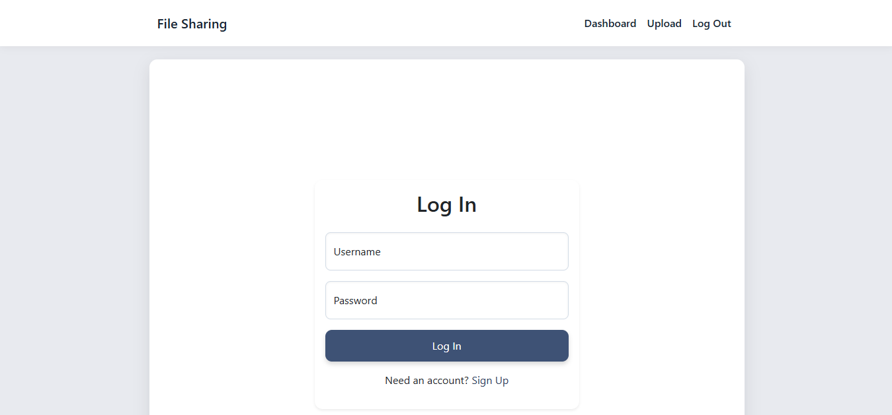
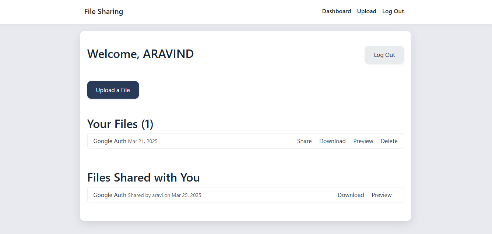
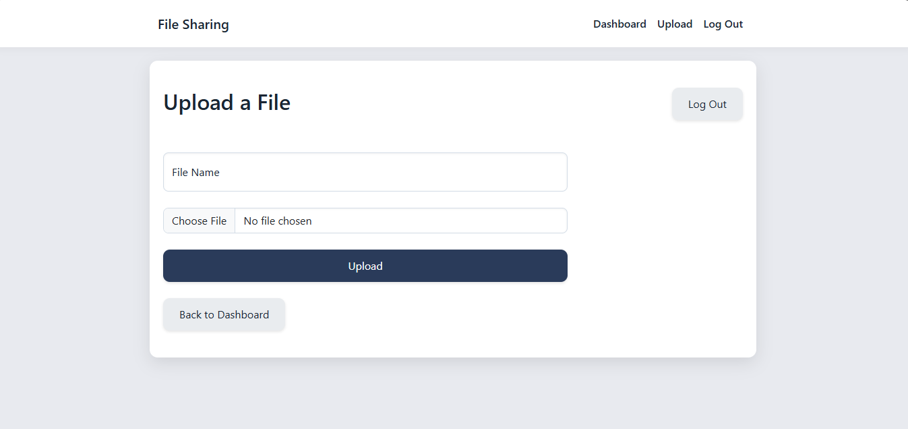
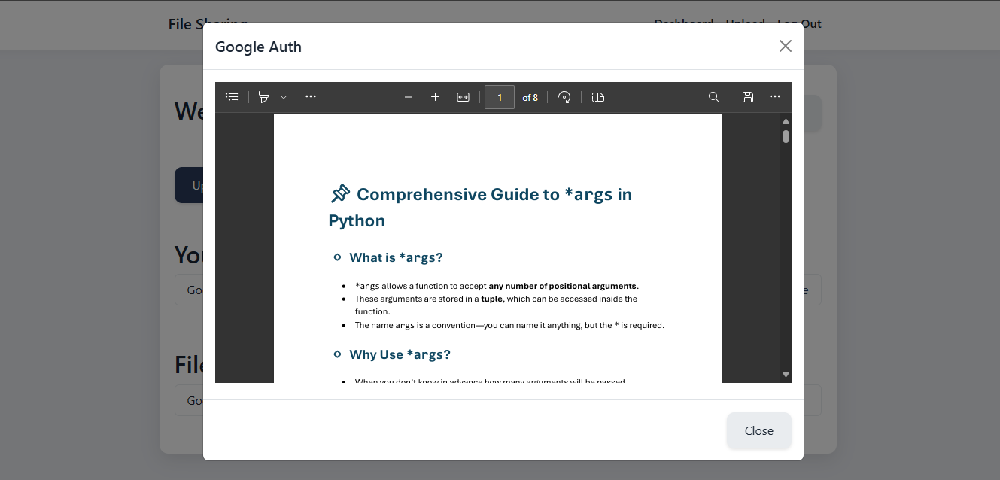
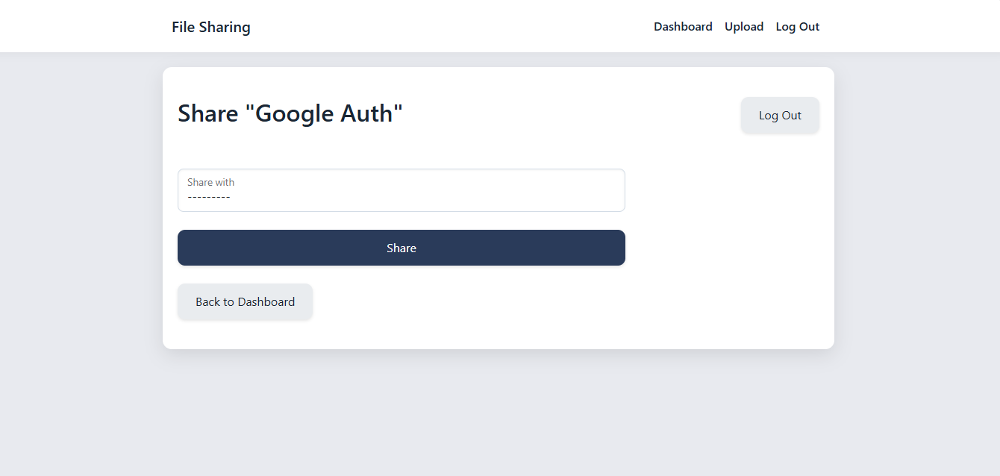

Here’s a polished, complete `README.md` for your File Sharing Platform, tailored to its current state—Dockerized, with signup/login, file uploads, dropdown-based sharing, and working image/PDF previews. It’s designed to be clear for anyone cloning from GitHub, with setup instructions, troubleshooting, and a professional touch for your portfolio. Since you’ve fixed the PDF preview, I’ll assume it’s all set with `X_FRAME_OPTIONS = 'SAMEORIGIN'` and direct media URLs.

---

### `README.md`
```markdown
# File Sharing Platform

A sleek, minimalistic web application built with Django for secure file uploads, sharing, and previews. Designed with a premium navy-gray-white UI, this app lets users manage files, share them with others via a dropdown, and preview images and PDFs in modals—all containerized with Docker for easy setup and deployment.







## Features
- **User Authentication**: Sign up, log in, and log out securely.
- **File Management**: Upload, download, and delete files with ease.
- **File Sharing**: Share files with other users via a dropdown selection.
- **File Previews**: View images (PNG, JPG, JPEG) and PDFs in modals.
- **Responsive UI**: Built with Bootstrap 5 and custom CSS for a premium look.

## Technologies
- **Backend**: Django 5.1.7, Python 3.11
- **Frontend**: Bootstrap 5, Custom CSS (navy-gray-white palette)
- **Database**: SQLite (default, local use)
- **Containerization**: Docker, Docker Compose
- **File Storage**: Local media directory (persistent via Docker volumes)
- **Version Control**: Git

## Prerequisites
- [Docker Desktop](https://www.docker.com/get-started) (Windows/Mac) or [Docker Engine](https://docs.docker.com/engine/install/) (Linux)
- Git (optional, for cloning)

## Setup Instructions

### 1. Clone the Repository
```bash
git clone https://github.com/yourusername/file-sharing-platform.git
cd file_sharing_platform
cd file_sharing_platform
```

### 2. Build the Docker Image
```bash
docker compose build
```
- This pulls Python 3.11-slim and installs dependencies from `requirements.txt`.

### 3. Run the Application
```bash
docker compose up
```
- Access the app at `http://127.0.0.1:8000`.
- The development server runs with live reloading.

### 4. Initialize the Database
- Open a new terminal in the project directory:
```bash
docker compose exec web python manage.py migrate
```
- Creates the SQLite database (`db.sqlite3`) with necessary tables.
- Optional: Create an admin user:
```bash
docker compose exec web python manage.py createsuperuser
```

### 5. Test the App
- Visit `http://127.0.0.1:8000` in your browser.
- Sign up, log in, upload files (images/PDFs), share with another user, and preview them in modals.

### 6. Stop the App
```bash
docker compose down
```
- Stops and removes the container, preserving local files (`media/` and `db.sqlite3`).

## Project Structure
```
file-sharing-platform/
├── core/               # Django app (models, views, templates)
├── media/              # Uploaded files (persistent via Docker volume)
├── Dockerfile          # Docker image configuration
├── docker-compose.yml  # Docker service definition
├── manage.py           # Django management script
├── requirements.txt    # Python dependencies
└── README.md           # This file
```

## Configuration Details
- **Media Files**: Stored in `media/uploads/` with URLs at `/media/uploads/...`.
- **Previews**: Enabled with `X_FRAME_OPTIONS = 'SAMEORIGIN'` in `settings.py`.
- **Database**: SQLite (`db.sqlite3`) stored in the project root, synced via Docker volume.

## Troubleshooting
- **Port Conflict**: If `8000` is in use, edit `docker-compose.yml` to `ports: - "8001:8000"`, then rebuild (`docker compose build`) and rerun.
- **Media Access**: Ensure your system allows write permissions to `media/`. Run `chmod -R 777 media/` (Linux/Mac) if needed.
- **Preview Errors**: Verify `X_FRAME_OPTIONS = 'SAMEORIGIN'` in `settings.py` and media URLs in templates (e.g., `<iframe src="{{ file.uploaded_file.url }}">`).
- **Logs**: Check container output with `docker compose logs` for errors.

## Deployment
This app is ready for local use or deployment to platforms like:
- **Render**: Free tier with Docker support (sleeps after inactivity).
- **Fly.io**: Free tier with persistent storage (always on).
- For production, consider switching to PostgreSQL and a static file server (e.g., AWS S3).

## Contributing
1. Fork the repository.
2. Create a feature branch (`git checkout -b feature/your-feature`).
3. Commit changes (`git commit -m "Add your feature"`).
4. Push to your fork (`git push origin feature/your-feature`).
5. Open a pull request.

## License
[MIT License](LICENSE) - Free to use, modify, and distribute.

## Contact
- **Author**: [Aravind Vinod] 
- **GitHub**: [Roguecolt](https://github.com/Roguecolt)
- **Email**: aaaarrvind@gmail.com

---
Built as a portfolio project to showcase Django, Docker, and modern web development skills. Enjoy sharing files securely!
```


